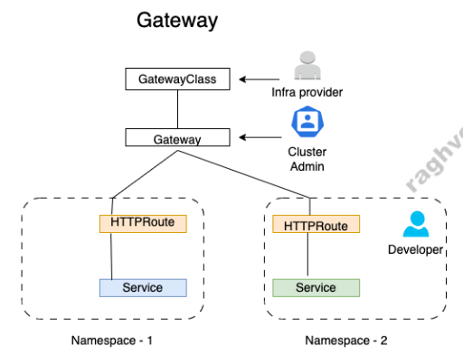

## Gateway API

---
### Azure Gateway API Implementation via Application Gateway for Containers (AGC)
In Azure Kubernetes Service (AKS), the standard Kubernetes Gateway API is primarily implemented through Application Gateway for Containers (AGC).

#### The ALB Controller 
It's responsible for translating Gateway API and Ingress API configuration within Kubernetes to load balancing rules within Application Gateway for Containers.  

[MS-Azure ALB Setup-Link](https://learn.microsoft.com/en-us/azure/application-gateway/for-containers/quickstart-deploy-application-gateway-for-containers-alb-controller-addon?tabs=azure-cli%2Cazure-cli2)

  

#### AGC (Application Gateway for Containers) 
Sits outside the cluster as a fully managed Azure cloud resource. It receives the configuration updates from the ALB Controller and performs the actual network heavy lifting—such as Layer 7 routing, SSL offloading, traffic splitting, and routing directly to your pod IPs via a delegated subnet.

#### ALB Controller is the control plane / Kubernetes operator. 
It is an in-cluster controller (running as pods inside your AKS cluster) that acts as the bridge between Kubernetes and Azure. It watches your Kubernetes custom resources (such as ApplicationLoadBalancer, Gateway, or Ingress) and automatically translates those definitions into Azure API configurations on the AGC instance.

#### High-Level Architecture
The architecture consists of two main environments: the `Kubernetes Cluster Control Plane` and the `Azure-Managed Infrastructure`.
```
+-----------------------------------------------------------------------------+
|                               AZURE CLOUD                                   |
|                                                                             |
|  +-----------------------------------------------------------------------+  |
|  |                   AKS CLUSTER (Kubernetes Control Plane)              |  |
|  |                                                                       |  |
|  |  +-------------------+        +----------------------------------+    |  |
|  |  | Gateway API Custom|        |       ALB Controller Pod         |    |  |
|  |  |   Resources CRD   |        | (Watches K8s resources & syncs)  |    |  |
|  |  | (GatewayClass,    |----->  |                                  |    |  |
|  |  |  Gateway,         |        +----------------------------------+    |  |
|  |  |  HTTPRoute)       |                         |                      |  |
|  +--+-------------------+-------------------------|----------------------+  |
|                                                   | Azure Resource          |
|                                                   | Manager (ARM) API       |
|                                                   v                         |
|  +-----------------------------------------------------------------------+  |
|  |             APPLICATION GATEWAY FOR CONTAINERS (Data Plane)           |  |
|  |                                                                       |  |
|  |  +---------------------+                +--------------------------+  |  |
|  |  |  Frontend Resource  |<---------------|  Association (Subnet)    |  |  |
|  |  | (Public/Private IP) |  Routes Traffic| (Delegated Subnet to AGC)|  |  |
|  |  +---------------------+                +--------------------------+  |  |
|  +-----------------------------------------------------------------------+  |
|                                                        |                    |
+--------------------------------------------------------|--------------------+
                                                         v
                                              +---------------------+
                                              |   Pod Endpoints     |
                                              | (Direct Pod-to-Pod) |
                                              +---------------------+
```


##### Core Components
1. Control Plane: ALB Controller
  - ALB Controller runs inside your AKS cluster.   
  - It continuously monitors Kubernetes resources like GatewayClass, Gateway, and HTTPRoute.   
  - When changes occur, it translates these Kubernetes definitions into Azure Resource Manager (ARM) API calls to program the Azure-managed AGC Data Plane.

2. Azure-Managed Data Plane: AGC Resources
   - Application Gateway for Containers Resource: The parent Azure resource holding the load-balancing configuration.
   - Frontend: Represents the entry point for client traffic (assigned a public IP address or internal IP).
   - Association: The link between AGC and your Azure Virtual Network (VNet) via a dedicated delegated subnet.
   - Subnet Delegation: Allows AGC to route Layer 7 traffic directly to pod IP addresses inside the cluster without intermediate NodePort overhead.

###  Workflow: How Traffic & Configuration Flow
```
1. User applies Manifests
                           (Gateway, HTTPRoute)
                                    |
                                    v
+-----------------------------------------------------------------------+
|                         AKS Cluster Namespace                         |
|                                                                       |
|   +-------------------+                     +----------------------+  |
|   |   HTTPRoute /     |                     |    ALB Controller    |  |
|   |     Gateway       |====================>|  (Translates K8s CRD |  |
|   +-------------------+   2. Event Watch    |   to ARM API updates)|  |
|                                             +----------------------+  |
+---------------------------------------------------------|-------------+
                                                          | 3. Programs Config
                                                          v
+-----------------------------------------------------------------------+
|                    Azure Application Gateway for Containers           |
|                                                                       |
|   +-------------------+                    +----------------------+   |
|   |  Azure AGC Data   |<===================| External Client      |   |
|   |      Plane        |   4. Incoming      | Request (HTTP/HTTPS) |   |
|   +-------------------+      Request       +----------------------+   |
+-------------|---------------------------------------------------------+
              |
              | 5. Direct Routing to Pod IP (Bypassing NodePort)
              v
+-----------------------------------------------------------------------+
|  +-------------------------------+   +-----------------------------+  |
|  | Pod 1 (App Backend 1)         |   | Pod 2 (App Backend 2)       |  |
|  | IP: 10.240.0.12              |   | IP: 10.240.0.13             |  |
|  +-------------------------------+   +-----------------------------+  |
+-----------------------------------------------------------------------+
```
---
### Key Differences from Standard Gateway API Architecture
```
STANDARD GATEWAY API (In-Cluster / Envoy)          AZURE AGC (Split-Plane Managed Model)
+---------------------------------------+         +---------------------------------------+
|  AKS Cluster                          |         |  AKS Cluster (Control Plane)          |
|  +---------------------------------+  |         |  +---------------------------------+  |
|  | Gateway API Controller           |  |         |  | ALB Controller Pod             |  |
|  +---------------------------------+  |         |  +---------------------------------+  |
|                   |                   |         |                  |                    |
|                   v                   |         |                  | (ARM API Sync)     |
|  +---------------------------------+  |         +------------------|--------------------+
|  | Gateway Data Plane (In-Cluster) |  |                            v
|  | (e.g. Envoy Proxy Pods/DaemonSet)| |         +---------------------------------------+
|  +---------------------------------+  |         |  Azure Managed Infrastructure         |
|                   |                   |         |  +---------------------------------+  |
|                   v                   |         |  | AGC Data Plane Engine           |  |
|  +---------------------------------+  |         |  | (Outside Cluster Ingress Nodes) |  |
|  | Application Pods                |  |         |  +---------------------------------+  |
|  +---------------------------------+  |         +------------------|--------------------+
+---------------------------------------+                            v
                                                  +---------------------------------------+
                                                  |  Application Pods (Direct IP Route)   |
                                                  +---------------------------------------+
```

----
## Configuring Azure AGC with Kubernetes Gateway API
To configure Application Gateway for Containers (AGC) on AKS, you need to set up the ALB Controller, assign the required Azure Managed Identity permissions, and deploy the Gateway API resources.

#### Strategy 1: ALB-Managed Deployment (Fully Automated)
In this approach, the ALB Controller dynamically provisions the AGC parent resource, frontend, and subnet associations in Azure when you apply the Gateway manifest.
```
+------------------------------------------------------------------+
|  1. Deploy Gateway Manifest (Kind: Gateway) in AKS               |
+------------------------------------------------------------------+
                               |
                               v
+------------------------------------------------------------------+
|  2. ALB Controller automatically provisions AGC, Frontend IP,    |
|     and Subnet Association via Azure Resource Manager (ARM)      |
+------------------------------------------------------------------+
                               |
                               v
+------------------------------------------------------------------+
|  3. Apply HTTPRoute Manifest to bind services & route traffic    |
+------------------------------------------------------------------+
```

Variable
```
$RESOURCE_GROUP = "rg1"
$AKS_NAME = "myAKSCluster"
$LOCATION = "eastus"
$VM_SIZE='Standard_B2s'
```

##### Step 1: Register Azure Resource Providers & Features
```
# Register required resource providers on Azure.
az provider register --namespace Microsoft.ContainerService
az provider register --namespace Microsoft.Network
az provider register --namespace Microsoft.NetworkFunction
az provider register --namespace Microsoft.ServiceNetworking

# Install Azure CLI extensions.
az extension add --name alb
az extension add --name aks-preview 

```
2. Register add-on feature
```
# Register required preview features
az feature register --namespace "Microsoft.ContainerService" --name "ManagedGatewayAPIPreview"
az feature register --namespace "Microsoft.ContainerService" --name "ApplicationLoadBalancerPreview"
```

### 2. Setup an AKS cluster with the AKS add-on
```

az group create --name $RESOURCE_GROUP --location $LOCATION
az aks create --resource-group $RESOURCE_GROUP --name $AKS_NAME --location $LOCATION --node-vm-size $VM_SIZE --network-plugin azure --enable-oidc-issuer --enable-workload-identity --enable-gateway-api --enable-application-load-balancer --generate-ssh-key

az aks get-credentials --resource-group $RESOURCE_GROUP --name $AKS_NAME
```

- Check ALB
  ```
  kubectl get pods -n kube-system | grep alb-controller
  ```

---

##### Step 3: Apply Gateway API Manifests
1. GatewayClass: Tells Kubernetes to use Azure AGC.
```yaml
apiVersion: gateway.networking.k8s.io/v1
kind: GatewayClass
metadata:
  name: azure-alb-external
spec:
  controllerName: alb.networking.azure.io/alb-controller
```
2. Gateway: Triggers the ALB Controller to provision AGC resources in Azure.
```yaml
apiVersion: gateway.networking.k8s.io/v1
kind: Gateway
metadata:
  name: agc-gateway
  namespace: default
  annotations:
    alb.networking.azure.io/alb-namespace: $RESOURCE_GROUP
    alb.networking.azure.io/alb-subnet-id: $SUBNET_ID
spec:
  gatewayClassName: azure-alb-external
  listeners:
    - name: http
      port: 80
      protocol: HTTP
      allowedRoutes:
        namespaces:
          from: Same
```
3. HTTPRoute: Routes incoming HTTP traffic to your backend services.
```yaml
apiVersion: gateway.networking.k8s.io/v1
kind: HTTPRoute
metadata:
  name: sample-app-route
  namespace: default
spec:
  parentRefs:
  - name: agc-gateway
  rules:
  - matches:
    - path:
        type: PathPrefix
        value: /
    backendRefs:
    - name: sample-app-service
      port: 80
```

---

## Strategy 2: Bring Your Own (BYO) Infrastructure
In enterprise environments with strict RBAC, infrastructure teams pre-provision the AGC resources in Azure using Terraform, Bicep, or CLI, and developers simply reference them.
```
+------------------------------------------------------------------+
|  1. Infra Team pre-creates AGC & Frontend Resource via Azure CLI |
+------------------------------------------------------------------+
                               |
                               v
+------------------------------------------------------------------+
|  2. Cluster Admin deploys Gateway referencing the existing      |
|     AGC Frontend Resource ID                                     |
+------------------------------------------------------------------+
                               |
                               v
+------------------------------------------------------------------+
|  3. App Dev deploys HTTPRoute attached to the pre-created Gateway |
+------------------------------------------------------------------+
```
###  Diagram for 1-to-1 ASCII mapping 
showing how the Kubernetes Gateway API resources correspond directly to the pre-created Azure Application Gateway for Containers (AGC) components in the BYO (Bring Your Own) Infrastructure

```
+------------------------------------+              +-------------------------------------+
| KUBERNETES CONTROL PLANE           |              | AZURE INFRASTRUCTURE (Pre-Created)  |
+------------------------------------+              +-------------------------------------+
|                                    |              |                                     |
|  [ GatewayClass ]                  |              |  [ Azure ALB Controller ]           |
|  spec.controllerName:              | -----------> |  (Watches K8s resources & syncs     |
|  alb.networking.azure.io/...       |  (Binds To)  |   config via ARM API updates)       |
|                                    |              |                                     |
|                 |                  |              |                  |                  |
|                 | (References)     |              |                  | (Contains)       |
|                 v                  |              |                  v                  |
|                                    |              |                                     |
|  [ Gateway ]                       |              |  [ AGC Parent Resource ]            |
|  kind: Gateway                     |              |  (Microsoft.ServiceNetworking/      |
|  listeners: [ HTTP/80 ]            |              |   trafficControllers)               |
|                 |                  |              |                  |                  |
|                 |                  |              |                  | (Contains)       |
|                 |                  |              |                  v                  |
|                 |                  |              |                                     |
|                 | (alb-frontend-id)|              |  [ Frontend Resource ]              |
|                 +-------------------------------->|  (Assigned Public/Private IP)       |
|                                    | (Attaches)   |                  |                  |
|                                    |              |                  | (Associated)     |
|                                    |              |                  v                  |
|  [ HTTPRoute ]                     |              |                                     |
|  spec.parentRefs: [ Gateway ]      |              |  [ Subnet Association ]             |
|  spec.rules: [ / -> Service ]      | -----------> |  (Routes traffic directly to        |
|                                    | (Directs)    |   Pod IPs via Delegated Subnet)     |
|                                    |              |                                     |
+------------------------------------+              +-------------------------------------+
```

Step 1: Pre-provision AGC Infrastructure via Azure CLI
```Bash
# 1. Create Application Gateway for Containers Resource
az network alb create -g <YOUR_RESOURCE_GROUP> -n my-agc-resource

# 2. Create Frontend Resource
az network alb frontend create -g <YOUR_RESOURCE_GROUP> --alb-name my-agc-resource -n my-frontend

# 3. Create Subnet Association
az network alb association create -g <YOUR_RESOURCE_GROUP> --alb-name my-agc-resource -n my-association \
  --subnet $SUBNET_ID
```
Step 2: Retrieve AGC Frontend Resource ID
```Bash
ALB_FRONTEND_ID=$(az network alb frontend show -g <YOUR_RESOURCE_GROUP> --alb-name my-agc-resource -n my-frontend --query id -o tsv)
```
Step 3: Apply BYO Gateway Manifest
In the BYO strategy, the Gateway resource links directly to the Azure Frontend ID via annotations:

```YAML
apiVersion: gateway.networking.k8s.io/v1
kind: Gateway
metadata:
  name: byo-agc-gateway
  namespace: default
  annotations:
    alb.networking.azure.io/alb-frontend-id: <ALB_FRONTEND_ID>
spec:
  gatewayClassName: azure-alb-external
  listeners:
  - name: http
    port: 80
    protocol: HTTP
    allowedRoutes:
      namespaces:
        from: Same
```
Step 4: Apply HTTPRoute
```YAML
apiVersion: gateway.networking.k8s.io/v1
kind: HTTPRoute
metadata:
  name: byo-app-route
  namespace: default
spec:
  parentRefs:
  - name: byo-agc-gateway
  rules:
  - matches:
    - path:
        type: PathPrefix
        value: /api
    backendRefs:
    - name: api-service
      port: 8080
```
Verification & Troubleshooting
Check the status of your Gateway and HTTPRoute inside the cluster:

```Bash
# Verify Gateway status and get assigned Public/Private IP
kubectl get gateway agc-gateway -n default

# Inspect detailed status and events
kubectl describe gateway agc-gateway -n default

# Check HTTPRoute binding status
kubectl get httproute sample-app-route -n default
```
When successfully reconciled, the Gateway status will show Programmed: True alongside the assigned IP address.


