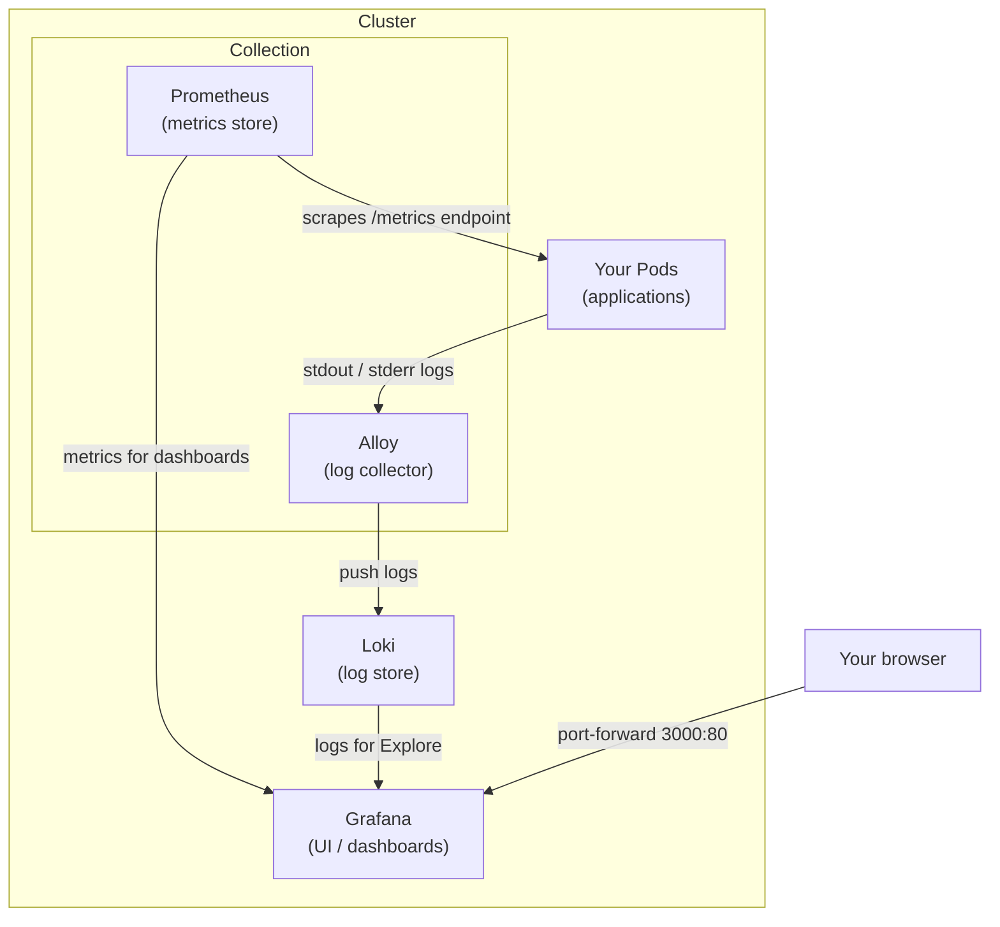

# Kubernetes Monitoring Stack Setup

This repository contains the configuration files and deployment instructions for setting up an observability stack in Kubernetes using **Prometheus**, **Loki**, **Alloy**, and **Grafana** managed via Helm.

---


### Add Helm repositories
```bash
    helm repo add prometheus-community https://prometheus-community.github.io/helm-charts
    helm repo add grafana https://grafana.github.io/helm-charts
    helm repo update

    ### Create a monitoring namespace
    kubectl create namespace monitoring
```
    


#### Installig  Order 
It should be noted that Alloy needs Loki up and running before it can forward logs, and Grafana needs both Prometheus and Loki available before it can configure its datasources. Installing in the wrong order leads to errors and failed connections.

We follow the natural dependency order. Metric and log storage that is Prometheus and Loki first, then Alloy to start collecting and forwarding logs, and finally Grafana once both data sources are in place:

#### Create Configuration (Values) Files
To keep resource consumption low and avoid remote/cloud dependencies, create the following local YAML configuration files to override default chart settings.

1. `prom-values.yaml` (Prometheus)
Disables alert manager, push gateway, and remote storage:
```yaml
alertmanager:
  enabled: false
pushgateway:
  enabled: false
server:
  remoteWrite: []
```
2. loki-values.yaml (Loki)
Configures Loki to run in single-binary mode with local filesystem storage:
```yaml
deploymentMode: SingleBinary
singleBinary:
  replicas: 1
backend:
  replicas: 0
read:
  replicas: 0
write:
  replicas: 0
loki:
  commonConfig:
    replication_factor: 1
  storage:
    type: filesystem
    useTestSchema: true
```
3. k8smon-values.yaml (Alloy Log Collector)Configures Alloy to read container log files from nodes and send them to Loki:
```yaml
cluster:
  name: my-cluster
destinations:
  localLoki:
    type: loki
    url: [http://loki-gateway.monitoring.svc.cluster.local/loki/api/v1/push](http://loki-gateway.monitoring.svc.cluster.local/loki/api/v1/push)
    tenantId: "1"
podLogsViaLoki:
  enabled: true
collector: alloy-singleton
collectors:
  alloy-singleton:
    presets: [filesystem-log-reader]
    selfReporting:
      enabled: false
```
4. grafana-values.yaml (Grafana)Pre-configures Prometheus and Loki datasources with default login credentials (admin/admin):
```bash
adminPassword: admin
datasources:
  datasources.yaml:
    apiVersion: 1
    datasources:
      - name: Prometheus
        type: prometheus
        access: proxy
        url: http://prom-prometheus-server
        isDefault: true
      - name: Loki
        type: loki
        access: proxy
        url: [http://loki-gateway.monitoring.svc.cluster.local](http://loki-gateway.monitoring.svc.cluster.local)
        jsonData:
          httpHeaderName1: X-Scope-OrgID
        secureJsonData:
          httpHeaderValue1: "1"
```

### Step 3: Install Helm Releases
Install the components in order based on dependency requirements (Metrics/Storage → Log Collector → Dashboard UI):
```bash
# 1. Install Prometheus
helm upgrade --install prom prometheus-community/prometheus --namespace monitoring  --values prom-values.yaml

# 2. Install Loki
helm upgrade --install loki grafana/loki --namespace monitoring --values loki-values.yaml

# 3. Install Alloy (k8s-monitoring)
helm upgrade --install k8smon grafana/k8s-monitoring --namespace monitoring --values k8smon-values.yaml

# 4. Install Grafana
helm upgrade --install grafana grafana/grafana --namespace monitoring --values grafana-values.yaml
```

### Verification & Access
- Check Pod Status
Ensure all releases are deployed and all pods are running:

```Bash
helm list --namespace monitoring
kubectl get pods -n monitoring
```

### Accessing Grafana Dashboard
Port-forward the Grafana service to access the UI locally:
```
kubectl port-forward --namespace monitoring svc/grafana 3000:80
```
### Port-forward the Prometheus server service:
```
kubectl port-forward --namespace monitoring svc/prom-prometheus-server 9090:80
```

### Querying Data in Grafana
Go to Explore mode in Grafana to run queries:

1. Prometheus (PromQL Examples)
- Total Pod Count across the cluster:
```
count(kube_pod_info)
```
- Breakdown of pods by namespace:
```
count by (namespace) (kube_pod_info)
```
2. Loki (LogQL Examples)
- View logs for pods in the default namespace:
```
{namespace="default"}
```
- Filter for specific error logs:
```
{namespace="default"} |= "error"
```

### Cleanup
To uninstall all releases and remove the setup:
```
helm delete prom -n monitoring
helm delete loki -n monitoring
helm delete k8smon -n monitoring
helm delete grafana -n monitoring
kubectl delete namespace monitoring
```