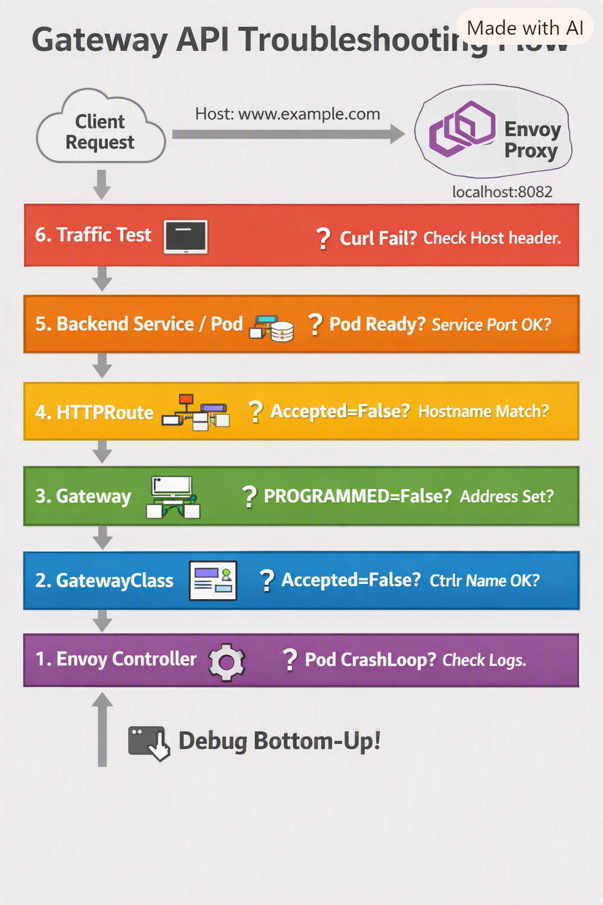

## 🛠 Gateway API Troubleshooting Playbook
#### Layer 1: Controller & Envoy Proxy
Check pods:

```bash
kubectl get pods -n envoy-gateway-system
```
  - `envoy-gateway-xxxx` → controller (must be Running).
  - `envoy-default-eg-xxxx` → Envoy proxy (must be Running).

- If CrashLooping or not Ready:

Inspect logs:

```bash
kubectl logs -n envoy-gateway-system <pod-name>
```
Common fixes:
  - CRDs not installed → reinstall Gateway API CRDs.
  - Wrong controller name in GatewayClass → fix manifest to `gateway.envoyproxy.io/gatewayclass-controller`.
  - Resource limits too tight → increase CPU/memory.

#### Layer 2: GatewayClass
Check:

```bash
kubectl get gatewayclass
```
 - Must show` Accepted: True.`
 - If Accepted=False:
   `Controller isn’t watching this GatewayClass.`

Fix: Ensure Helm chart installed correctly and controller name matches.

#### Layer 3: Gateway
Check:

bash
kubectl get gateway -n default
Must show PROGRAMMED: True and an ADDRESS.

If PROGRAMMED=False:

GatewayClass not accepted.

Controller not running.

Listener misconfigured (wrong port/protocol).

Fix: Correct listener port (e.g., 80 for HTTP), ensure GatewayClass is valid.

Layer 4: HTTPRoute
Check:

bash
kubectl describe httproute backend -n default
Must show Accepted: True.

If Accepted=False:

Gateway not found or not programmed.

Hostname mismatch (e.g., request Host header doesn’t match www.example.com).

Fixes:

Use correct Host header in curl/browser.

Patch HTTPRoute to accept all hostnames:

yaml
hostnames:
  - "*"
Layer 5: Backend Service & Pod
Check:

bash
kubectl get svc,pods -n default
Service backend exists with port 3000.

Pod backend-xxxx is Running and Ready.

If Service missing or wrong port:

Fix Service manifest to expose correct port.

If Pod not Ready:

Inspect logs:

bash
kubectl logs backend-xxxx -n default
Fix: Ensure image is correct (registry.k8s.io/gateway-api/echo-basic:v1.5.1), adjust resources.

Layer 6: Traffic Test
Linux/macOS/WSL:

bash
curl -H "Host: www.example.com" http://localhost:8082
Windows PowerShell:

powershell
Invoke-WebRequest http://localhost:8082 -Headers @{Host="www.example.com"}
Browser:  
Add to hosts file:

Code
127.0.0.1   www.example.com
Then open:

Code
http://www.example.com:8082
If traffic fails:

Verify Host header matches HTTPRoute.

Check Envoy proxy logs:

bash
kubectl logs -n envoy-gateway-system <envoy-default-eg-pod>
Fixes:

Wrong hostname → patch HTTPRoute to *.

Wrong backend port → ensure HTTPRoute backendRefs match Service port.

No external IP → use NodePort mapping (30080 → localhost:8082).

🔎 Debugging Ladder
Pods running? → Fix controller install.

GatewayClass accepted? → Fix controller name.

Gateway programmed? → Fix Gateway spec.

HTTPRoute accepted? → Fix ParentRefs/hostname.

Backend Service/Pod healthy? → Fix app/service.

Traffic test with Host header. → Fix hostname/port mapping.




