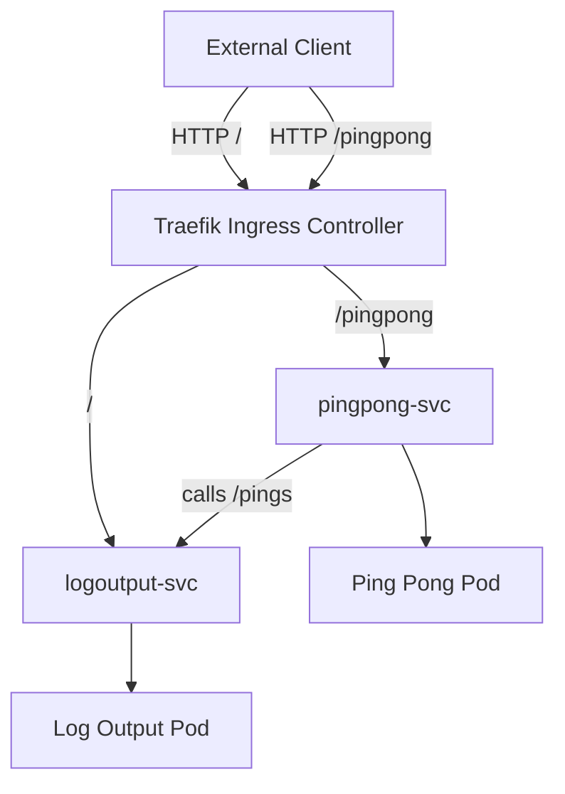

**the logic behind how the updated Log Output application interacts with the Ping Pong application:**

## 📝 Note on Earlier Design

In an earlier version of this setup, the Ingress was configured to **override `/pingpong` to `/`**, so that **both apps listened on `/` externally**:

- **Log Output App** → `/`  
- **Ping Pong App** → `/` (via Ingress rewrite from `/pingpong`)  

This approach worked technically, but it introduced **routing ambiguity** because Traefik had multiple backends bound to the same root path. Requests to `/` were load‑balanced between both apps, which made debugging and user access confusing.

### Why the design was changed
- Having multiple apps exposed at `/` caused unpredictable behavior.  
- It was unclear which app a client would hit when accessing `/`.  
- Logs and counters could appear inconsistent depending on which backend responded.  

### Current clean design
- `/` → **Log Output App only**  
- `/pingpong` → **Ping Pong App only**  
- Ping Pong’s `/` endpoint remains **internal only** (not exposed via Ingress). 


```
                   +---------+
                   | Browser |
                   +---------+
                   /       \
                  /         \
             GET /           GET /pingpong
                /             \
               v               v
+----------------+             +----------------+
| Log Output App |<------------| Ping Pong App  |
+----------------+  GET /pings +----------------+ 

```
### Both apps are webapps

- The Log Output App is accessible at endpoint  `/`.

- The Ping Pong App is accessible at endpoint  `/pingpong`.

### The `/pings` endpoint 
- /pings is not a browser endpoint.

- It’s an internal API call: the Ping Pong App calls the Log Output App’s /pings endpoint to report the updated ping count whenever the browser triggers /pingpong
- /pings is the bridge between the two apps. The browser never directly hits /pings; instead, the Ping Pong App uses it to push its state (the incremented pong value) into the Log Output App.

### Logical Flow
- Browser → GET / → Log Output App → returns logs + current ping count.

- Browser → GET /pingpong → Ping Pong App → increments counter.

- Ping Pong App → GET /pings → Log Output App → updates its stored ping count.

- Next time the browser calls /, the log output reflects the new ping count.

```
2026-05-18T12:15:17.705Z: 8523ecb1-c716-4cb6-a044-b9e83bb98e43
Ping / Pongs: 3
```
--- 

### Refreshing the networking 
1. Ping Pong App / Todo Backend Port
Container Port (targetPort): 3000 (This is the port where the backend server application listens inside the container).

Service Port (port): 2345 (This is the stable, internal cluster port exposed by the ClusterIP service for cross-pod communication).

2. The Ingress Logic
An Ingress routes external public traffic from the internet into your cluster services.

Following the project application architecture, your Ingress will expose the endpoints externally via port 80 (HTTP) and route them to your internal services.

Here is how the complete networking stack bridges together using the Project ports from Chapter 2:
```
[ Internet Traffic ] 
       │ (Port 80)
       ▼
 ┌───────────┐
 │  Ingress  │
 └─────┬─────┘
       │
       ├─► [ GET /pingpong ] ──► pingpong-svc (Port 2345) ──► Pod Container (Port 5000)
       │
       └─► [ GET /         ] ──►log-output-svc (Port 2345) ──► Pod Container (Port 5000)
```

### How this ties into Kubernetes Services
- Ping Pong Service (pingpong-svc)

   * port: 2345 → exposed inside the cluster.

   * targetPort: 5000 → maps to Flask app’s container port.

- Log Output Service (logoutput-svc)

  * port: 2345 → exposed inside the cluster.

  * targetPort: 5000 → maps to Flask app’s container port.

#### So inside the cluster:

- Browser (or another pod) calls `pingpong-svc:2345/pingpong`.

- Ping Pong App increments counter and calls `logoutput-svc:2345/pings`.

# Ping Pong & Log Output App on Kubernetes

## 📌 Overview
This project demonstrates a two‑app system deployed on Kubernetes:

- **Ping Pong App**
  - Endpoints:
    - `/` → shows current pong count (internal only, not exposed via Ingress).
    - `/pingpong` → increments pong count and notifies Log Output App.
  - Runs on Flask, container port `5000`.

- **Log Output App**
  - Endpoints:
    - `/` → displays latest generated log entry + ping count (exposed externally).
    - `/pings` → increments ping count when called by Ping Pong App.
  - Generates a new log entry every 5 seconds in a background thread.
  - Runs on Flask, container port `5000`.

---

## ⚙️ Kubernetes Resources

### Deployments
- `pingpong-deployment` → runs Ping Pong Flask app.
- `logoutput-deployment` → runs Log Output Flask app.

### Services
- `pingpong-svc` → ClusterIP service exposing Ping Pong on port `2345`.
- `logoutput-svc` → ClusterIP service exposing Log Output on port `2345`.

### Ingress (Traefik)
- `/` → Log Output App (`logoutput-svc:2345`)
- `/pingpong` → Ping Pong App (`pingpong-svc:2345`)

---

## 🚀 Accessing the Apps

### Inside the Cluster
- Ping Pong App calls Log Output via Service DNS:


