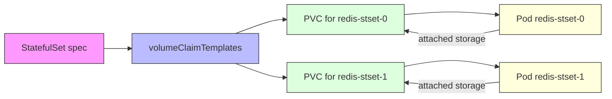

# StatefulSet
StatefulSets are for stateful applications, where the state is stored inside the app, not outside, such as in a database. 

StatefulSets are ideal for scaling applications that require persistent state, such as video game servers (e.g., Minecraft servers) or databases. One key advantage of using StatefulSets is that they ensure data safety by not deleting the associated volumes when the StatefulSet is deleted.

## StatefulSet storage with volumeClaimTemplates

In a standard `Deployment`, volume configuration is split into two steps:

- create a `PersistentVolumeClaim` (PVC) YAML file
- reference that PVC by name inside the deployment's `volumes` block

The `volumeClaimTemplates` block inside a `StatefulSet` spec changes this completely. Instead of linking to a single pre-existing PVC, it acts as a dynamic blueprint factory for storage.

## Visual overview

## How it works

### 1. Dynamic PVC creation per pod

With a `Deployment`, scaling to 3 replicas means all pods try to bind to the same PVC. If the volume access mode is `ReadWriteOnce`, Kubernetes will not allow multiple pods to attach to the same volume safely.

With a `StatefulSet`, scaling to 3 replicas causes `volumeClaimTemplates` to generate a separate PVC for each replica:

- `redis-stset-0` gets `data-redis-stset-0`
- `redis-stset-1` gets `data-redis-stset-1`

Each pod receives its own individual PVC.

### 2. Coupled to network identity

`StatefulSet` pods have stable, predictable names like `pod-0`, `pod-1`, etc. Because `volumeClaimTemplates` creates matching PVCs, storage becomes permanently associated with that pod identity.

If `redis-stset-0` crashes and is rescheduled on a different node, Kubernetes can reattach the same PVC (`data-redis-stset-0`) to the same pod identity.

### 3. Leverages dynamic provisioning

In the course example, the template includes `storageClassName: local-path`.

That means you do not need to manually pre-create `PersistentVolume` objects or individual PVC YAML files. Kubernetes (or K3s) provisions storage automatically for each replica when the StatefulSet scales.

## Why use `volumeClaimTemplates`?

- simplifies storage management
- creates one PVC per pod automatically
- preserves pod-to-volume identity
- supports dynamic provisioning via storage classes