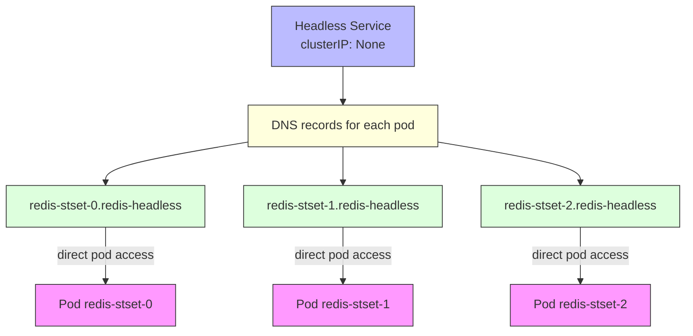

# Headless Service for StatefulSet

A headless service is a special Kubernetes `Service` where `clusterIP: None`.

## What makes it headless?

- Normal `Service` gets a cluster IP.
- Headless service does not.
- Instead of load-balancing through a virtual IP, Kubernetes creates DNS entries for the individual pods.

## Why StatefulSet uses a headless service

Stateful apps usually need stable network identities and direct pod access.

- StatefulSet pods have stable hostnames: `app-0`, `app-1`, `app-2`.
- A headless service enables DNS resolution for each pod.
- This allows each replica to be addressed directly, which is essential for clusters, replicas, leader election, and peer discovery.

## Typical headless service YAML

```yaml
apiVersion: v1
kind: Service
metadata:
  name: redis-headless
spec:
  clusterIP: None
  selector:
    app: redis
  ports:
  - port: 6379
```

## How DNS works for headless services

With a headless service named `redis-headless` in namespace `default`:

- `redis-stset-0.redis-headless.default.svc.cluster.local` → pod `redis-stset-0`
- `redis-stset-1.redis-headless.default.svc.cluster.local` → pod `redis-stset-1`
- `redis-stset-2.redis-headless.default.svc.cluster.local` → pod `redis-stset-2`

Clients can resolve the exact pod, not a load-balanced IP.

## Visual explanation



## Quick comparison

- Normal Service: one cluster IP, load-balances across pods.
- Headless Service: no cluster IP, DNS points to each pod individually.

## When to use it

- StatefulSets
- Clusters requiring stable peer identities
- Database replicas
- Stateful distributed systems

## Summary

A headless service gives StatefulSet pods stable DNS names and direct access. It is the mechanism that allows each replica to be discovered and addressed without a shared virtual IP.