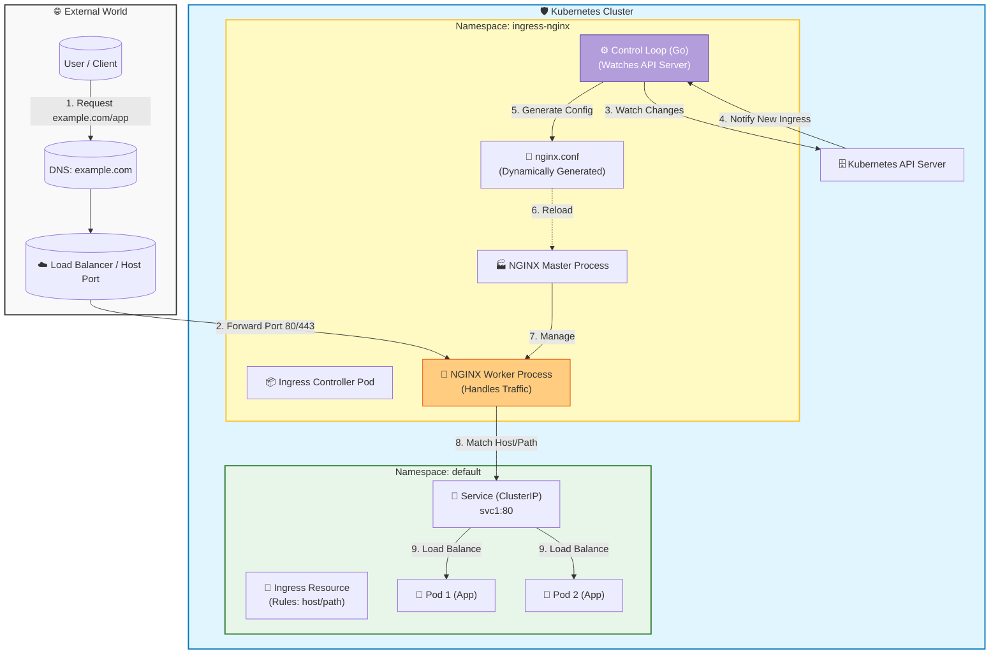

## When you create an Ingress Controller (like NGINX)
#### 1. Deployment of Controller Pods
Kubernetes creates a Deployment (or DaemonSet) running the controller software (e.g., nginx-ingress-controller). 


**This Controller pod contains two main parts:**
* Control Loop: A Go-based process that watches the Kubernetes API for changes to Ingress, Service, and Secret objects.
* Data Plane: The actual `NGINX web server` process that handles traffic.

#### 2. Creation of a LoadBalancer Service
The installation typically creates a Kubernetes Service of type LoadBalancer in front of the controller pods. 

* Cloud Providers: This triggers your cloud provider (AWS, GCP, Azure, etc.) to provision an external Load Balancer with a public IP address. 
* Local Clusters (k3d/minikube): Since there is no cloud load balancer, the service often remains Pending unless you use specific flags (like --port 80:80@loadbalancer in k3d) to map host ports directly to the controller.


#### 3. Configuration Synchronization (The "Watch" Loop)
The controller starts a continuous reconciliation loop:

* *Watches*: It listens for any new or updated Ingress resources you create.
* *Translates* : When you create an Ingress object (like your ing1 example), the controller reads the rules (host/path) and `dynamically generates a native nginx.conf `file. 
* *Reloads*: It signals the NGINX process to reload (nginx -s reload) with the new configuration.
Note: Changes to backend Pod IPs (scaling up/down) are handled via Lua scripts inside NGINX to avoid a full reload, ensuring zero downtime
```ascii
       🌈 EXTERNAL WORLD 🌈
      +------------------+
      |   🙋 User        |
      |  (Browser)       |
      +--------+---------+
               |
               | 1. 🚀 "Hello! Can I visit /app?"
               v
      +--------+---------+
      |  ⚖️ Load Balancer| <--- (Cloud LB or Host Port 🚪)
      |  (Public IP)     |
      +--------+---------+
               |
               | 2. 📦 Forwarding Traffic...
               v
+-----------------------------------------------------------------+
|  🛡️ KUBERNETES CLUSTER (The Playground)                         |
|                                                                 |
|   +--------------------------+  +---------------------------+   |
|   |  🤖 Ingress Controller   | |   🧠 Kubernetes API       |   |
|   |(Namespace: ingress-nginx) | |   Server                  |   |
|   |                           | |                           |   |
|   |  +---------------+        | |  +---------------------+  |   |
|   |  | 👀 Control    |<---------+ | 📜 Ingress Resource |  |   |
|   |  |    Loop       |  |     |  | (YAML: ing1)        |    |   |
|   |  | (Watches API) |  |     |  | - 🏠 Host: example  |    |   |
|   |  +-------+-------+  |     |  | - 🛣️ Path: /app     |    |   |
|   |          |          |     |  +---------------------+     |   |
|   |          | ✨ Updates|    |                              |   |
|   |          v          |     +---------------------------+   |
|   |  +---------------+  |               ^                     |
|   |  | 🏭 NGINX      |  |               | 3. 📝 Config Update |
|   |  |    Process     |  |               |                     |
|   |  | (Data Plane)   |  |               |                     |
|   |  | -🗺️ Reads Rules| |               |                     |
|   |  | -🚦 Routes    |  |               |                     |
|   |  +-------+-------+  |               |                     |
|   +----------|---------+               |                     |
|              |                         |                     |
|              | 4. 🚚 Proxy Request     |                     |
|              v                         |                     |
|   +----------+--------+                |                     |
|   |   🔷 Service      |                |                     |
|   |   (svc1) 💌       |                |                     |
|   +----------+--------+                |                     |
|              |                         |                     |
|              | 5. 🎲 Load Balance      |                     |
|              v                         |                     |
|   +----------+--------+                |                     |
|   |   🐳 Pod (App)    |                |                     |
|   |   (Port 3000) 🎉  |                |                     |
|   +-------------------+                |                     |
|                                                               |
+---------------------------------------------------------------+
```
#### 4. Traffic Routing
Once running, the Ingress Controller becomes the single entry point for your cluster:

- 1.External traffic hits the Load Balancer IP (or host port).
- 2.The Controller inspects the Host header and URL path. 
- 3.It routes the request to the correct internal ClusterIP Service based on your rules.


